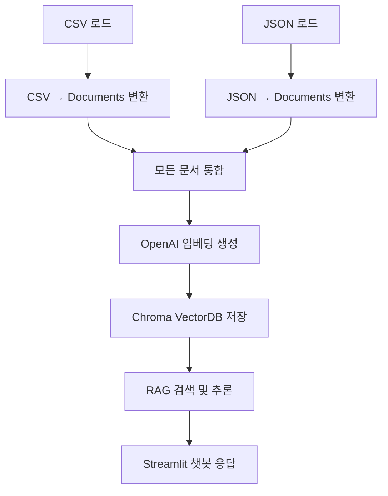

<p align="center">
  
</p>

<p align="center">
  📌 <strong>민방위 대피시설 + 재난 행동요령 데이터 기반 RAG & 챗봇 시스템</strong><br>
  <sub>SK Networks Family 20기 — 3RD 5TEAM</sub>
</p>

<p align="center">
  🔍 <strong>CSV + JSON → LangChain Document → Embedding → ChromaDB → Streamlit Chatbot</strong>
</p>

<p align="center">
  <a href="#-프로젝트-개요">프로젝트 개요</a> •
  <a href="#-전체-파이프라인">전체 파이프라인</a> •
  <a href="#-기술-스택">기술 스택</a> •
  <a href="#-설치--실행">설치 & 실행</a> •
  <a href="#-streamlit-챗봇">Streamlit 챗봇</a> •
  <a href="#-테스트-계획--결과">테스트 결과</a> •
  <a href="#-산출물-정리">산출물 정리</a>
</p>

---

## 📌 프로젝트 개요
본 프로젝트는 **민방위 대피 시설(CSV)** 과 **재난 행동요령(JSON)** 데이터를 통합하여  
LangChain 기반 **RAG(Retrieval-Augmented Generation)** 시스템에 최적화된 **Vector Database + 실시간 챗봇**을 구축하는 프로젝트입니다.

사용자는 **Streamlit 기반 웹 인터페이스**에서  
재난 상황에 대한 질문 또는 대피소 위치 관련 질의를 입력하면  
벡터 검색 기반으로 **근거 기반 답변**을 제공합니다.

---

## ⚙ 전체 파이프라인



---

## 👥 팀구성
|  <br> 문창교 |   <br> 권규리 |   <br> 김황현 |   <br> 김효빈 |   <br> 이승규 |
|:------:|:------:|:------:|:------:|:------:|
| <a href="https://github.com/kimobi"></a> | <a href="https://github.com/hyeonnll"></a> | <a href="https://github.com/kimobi"></a> | <a href="https://github.com/mansio0314"></a> | <a href="https://github.com/mminguu"></a> |

---
<p align="center" style="margin-bottom: 14px;">

## 💻 기술 스택

| 분류 | 사용 기술 |
|------|-----------|
| 언어 |  <span style="display:inline-block; width:180px;">Python</span> |
| 프레임워크 |  <span style="display:inline-block; width:180px;">LangChain</span> |
| 웹 UI |  <span style="display:inline-block; width:180px;">Streamlit</span> |
| 임베딩 모델 |  <span style="display:inline-block; width:180px;">OpenAI</span> |
| 벡터 DB |  <span style="display:inline-block; width:180px;">ChromaDB</span> |
| 데이터 전처리 |  <span style="display:inline-block; width:180px;">pandas</span> |
| 환경 변수 관리 |  <span style="display:inline-block; width:180px;">python-dotenv (.env)</span> |

</p>
</div>
---

## 📁 프로젝트 구조

```
SKN20-3RD-5TEAM/
├── data/
│   ├── shelter.csv
│   ├── natural_disaster/*.json
│   └── social_disaster/*.json
├── chroma_db/
├── data_loaders.py
├── documents.py
├── embedding_and_vectordb.py
├── from_DataLoad_to_VectorDB.py
└── chatbot_streamlit.py
```

---

## 🚀 설치 & 실행

### 1️⃣ 패키지 설치
pip install -r requirements.txt

### 2️⃣ 환경변수 설정 (.env)
OPENAI_API_KEY=본인키

### 3️⃣ 전체 RAG 파이프라인 실행 (VectorDB 생성)
python from_DataLoad_to_VectorDB.py

### 4️⃣ Streamlit 챗봇 실행
streamlit run chatbot_streamlit.py

---

## 🔗 html 챗봇
| 서비스 | 접속 링크 |
|--------|-----------|
| 민방위 대피시설 · 재난 행동요령 실시간 질의응답 챗봇 | 🔗 **https://61.78.100.228:8443/** |

> ⚠ 접속 시 브라우저에서 **보안 인증서 경고(Your connection is not private / NET::ERR_CERT)** 문구가 노출될 수 있습니다.  
> 이는 **자가 서명 인증서(Self-signed cert)** 사용으로 인한 것이며 악성 사이트가 아닙니다.

📌 접속 방법  
Chrome → “고급(Advanced)” → “사이트로 이동(Proceed)” 클릭

🎯 제공 기능
- 대피소 위치 / 주소 / 수용 인원 안내
- 재난 유형별 행동요령 / 신고 절차 / 주의사항 제공
- VectorDB 기반 Top-K 검색으로 **환각 최소화**

🔥 지금 바로 체험하기 → https://61.78.100.228:8443/

---

## 📦 산출물 정리

| 요구 산출물 | 제공 항목 |
|------------|-----------|
| 수집된 데이터 및 전처리 | data/ 폴더 및 Document 변환 |
| 시스템 아키텍처 | 파이프라인 및 Mermaid 다이어그램 |
| 개발된 소프트웨어 | Python 스크립트 5종 |
| 배포 환경 | html 외부 접속 URL |

---

## 🌱 향후 개선 계획
- 사용자 위치 기반 대피소 추천 카테고리(장애인, 유아 등에 맞추어) 검색 기반할 수 있도록 개선하면 좋을것 같음
- 질문 의도 분류 + Retrieval Routing
- RAG 평가 지표 적용(RAGAS)
---
